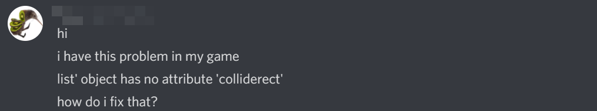
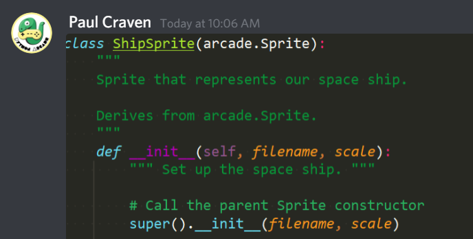
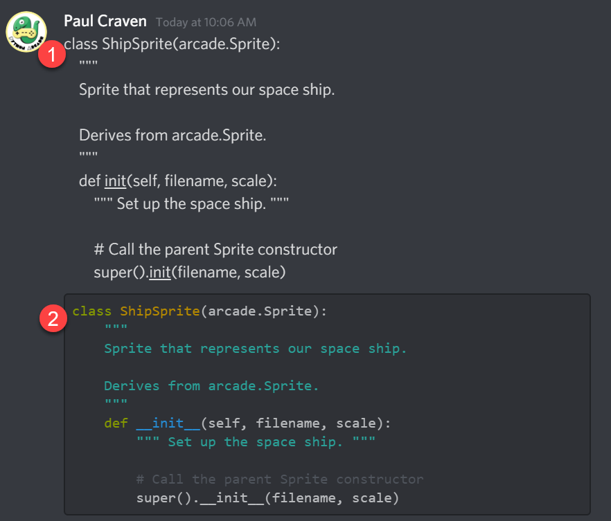
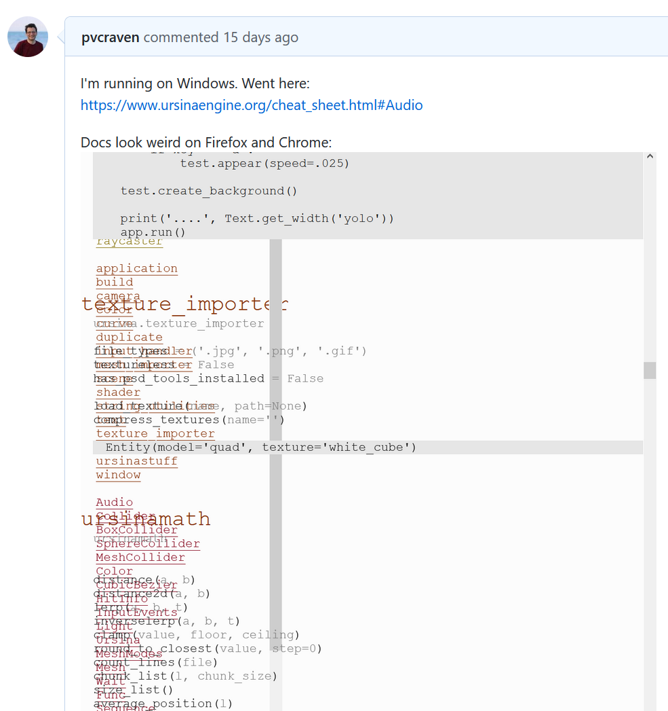

How to Ask a Technical Question
===============================

Tech people often love to help others, and answer questions. These
people could be other students, people you know at work, or even
members of larger communities that hang out together on-line.

To newcomers, it can often seem completely baffling on which
questions are answered. Some questions are
answered in minutes, while others are completely ignored. Why?

Most of the reason boils down to one thing -- how the question
is asked.

The Right Way to Ask a Question
-------------------------------

**Show you've done your research.** There's a *ton* of information
out there on the web. In the example below,
the person doesn't look like he's even
attempted to search online for "how to install pygame."

This question falls under the "Here, let me Google that for you" category.
No one is going to want to bother answering it.

A better question that shows the person
has done research: "Hi, I've tried following this tutorial
[link] and this other tutorial [link] for installing Pygame, but I get
stuck on the third step because when I type 'python' is says
'command not found'." *That* question shows you've done your
research and put some effort into it.

**Be specific.** Here's an example of a question that isn't very
specific:

This person did not list the code that caused the error, or talk about
what she did to get the error. Whoever tries answering will first have
to ask a lot of basic questions. What was the exact error that you got?
What was the code that caused it? What were you trying to do? That's
*exhausting*. Anyone asking a question should include the
info to begin with.

**Include code relevant to the error.** Include the part of the code that is
causing the problem. The "holy grail" of doing this, is to include a small
program a person can run to replicate the error.

**Make code readable.** Whatever platform you are using to get help, learn
how to format code on it. For example, in the example below the person has
pasted an *image* of
the code. So if I was trying to answer a question, I can't copy and edit or try
out the code. I'd have to retype it.

The next image shows two examples. In the first (1) part, the code is just
pasted into a chat window. The chat has incorrectly mangled some of the code,
and it isn't
formatted nicely. In the second part (2) the person learned to use the chat's
code formatting tool. Now the code looks great *and* it is easy to copy so that
a person answering your question doesn't have to retype the code.

**Include error messages**. It is a good idea to include the full error message
with your question if you question involves an error. For example here is a
(long) error message.

.. code-block:: text

    C:\Users\craven\Desktop\WebServer\arcade\venv38\Scripts\python.exe C:/Users/craven/Desktop/WebServer/arcade/arcade/examples/asteroid_smasher.py
    Traceback (most recent call last):
      File "C:/Users/craven/Desktop/WebServer/arcade/arcade/examples/asteroid_smasher.py", line 411, in <module>
        main()
      File "C:/Users/craven/Desktop/WebServer/arcade/arcade/examples/asteroid_smasher.py", line 407, in main
        arcade.run()
      File "C:\Users\craven\Desktop\WebServer\arcade\arcade\window_commands.py", line 236, in run
        pyglet.app.run()
      File "C:\Users\craven\Desktop\WebServer\arcade\venv38\lib\site-packages\pyglet\app\__init__.py", line 107, in run
        event_loop.run()
      File "C:\Users\craven\Desktop\WebServer\arcade\venv38\lib\site-packages\pyglet\app\base.py", line 167, in run
        timeout = self.idle()
      File "C:\Users\craven\Desktop\WebServer\arcade\venv38\lib\site-packages\pyglet\app\base.py", line 243, in idle
        window.dispatch_event('on_draw')
      File "C:\Users\craven\Desktop\WebServer\arcade\venv38\lib\site-packages\pyglet\window\__init__.py", line 1333, in dispatch_event
        if EventDispatcher.dispatch_event(self, *args) != False:
      File "C:\Users\craven\Desktop\WebServer\arcade\venv38\lib\site-packages\pyglet\event.py", line 553, in dispatch_event
        self._raise_dispatch_exception(
      File "C:\Users\craven\Desktop\WebServer\arcade\venv38\lib\site-packages\pyglet\event.py", line 603, in _raise_dispatch_exception
        raise exception
      File "C:\Users\craven\Desktop\WebServer\arcade\venv38\lib\site-packages\pyglet\event.py", line 550, in dispatch_event
        if handler(*args):
      File "C:/Users/craven/Desktop/WebServer/arcade/arcade/examples/asteroid_smasher.py", line 240, in on_draw
        arcade.draw_text(10, output, 10, 70, arcade.color.WHITE, 13)
      File "C:\Users\craven\Desktop\WebServer\arcade\arcade\text.py", line 272, in draw_text
        r, g, b, alpha = get_four_byte_color(color)
      File "C:\Users\craven\Desktop\WebServer\arcade\arcade\drawing_support.py", line 62, in get_four_byte_color
        if len(color) == 4:
    TypeError: object of type 'int' has no len()

    Process finished with exit code 1

**Include screenshots.** If things appear differently for you, include a screenshot.
For example, here's a bug I filed that showed how a web page appeared for me:

It looked find for the developer, so he needed to see on my screen what was happening.

When taking screenshots, there is a "Snipping Tool" on windows that allows you to
screenshot just part of a window. Alternatively, you can use Alt-PrintScreen
which will copy the active window. Then paste it in Microsoft Paint and save it.
Don't screenshot your *entire* window with the PrintScreen button. That's too
much waste.

