Discord How-To
==============

`Discord <https://discord.com/new>`_ is a program that allows team communication. There are many products
similar to discord:

* `Slack <https://slack.com/>`_
* `Google Groups <https://groups.google.com/forum/#!overview>`_
* `Microsoft Teams <https://www.microsoft.com/en-us/microsoft-365/microsoft-teams/group-chat-software>`_
* `Mattermost <https://mattermost.com/>`_

This is the main window for Discord:

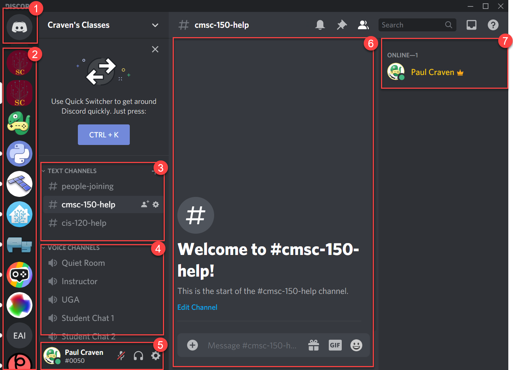

1. This icon lets you manage direct messages (DMs) and friends.
2. These icons are for your servers. I belong to servers for the Arcade
   library, the Python language, the tiled map editor, home automation, and more.
3. Text channels allow you to type text, post images, video clips, emoji's,
   and gifs.
4. Voice channels allow you to conference call with voice, and optionally video
   and screen sharing.
5. This part is you. It allows you to mute your microphone, your audio, hang
   up on voice calls, and change your settings.
6. When doing text of video chat, you'll see the content here.
7. You can see who is on-line of off-line with your server here.

Text Channels
-------------

To change channels, just double-click on the channel:

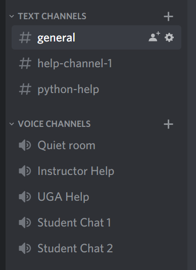

After typing a message in a text channel, you can hover over it to the right
of the message and get options. You can 'like' other people's messages. You can
even edit your own message, or delete it.

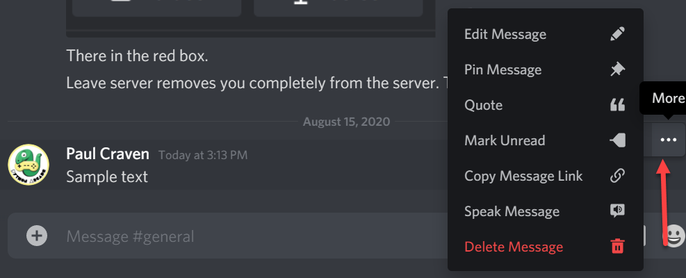

You can 'ping' someone by using an `@`. For example, if you type an `@` it will
come up with a list of people matching as you type. Select the person. In my case,
I have the Discord app on my phone and it will alert me. Great if you've got
a time-sensitive question.

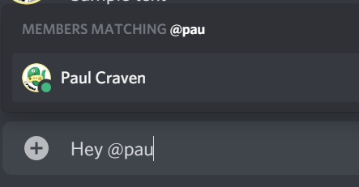

You can enter multiple lines at one by hitting shift-enter instead of just
enter.

Messages are formatted by some simple
`Markdown <https://www.markdownguide.org/>`_.
So you can do a bit of formatting.

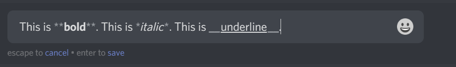

The most important markdown is the ability to put in fragments of code.
Surround your code with three back-ticks. (A back-tick is the key in the
upper-left of your keyboard, under the Esc key.) You can also tell
Discord what language you are typing in so that it highlights the code
properly:

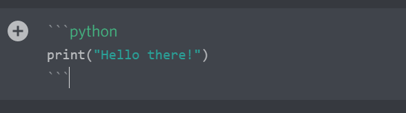

Only past short code samples, no more than 20 lines. If you need a longer set of
code, there are websites like `PasteBin <https://pastebin.com/>`_. Go there,
paste in your program, and then put a link to the program in Discord.

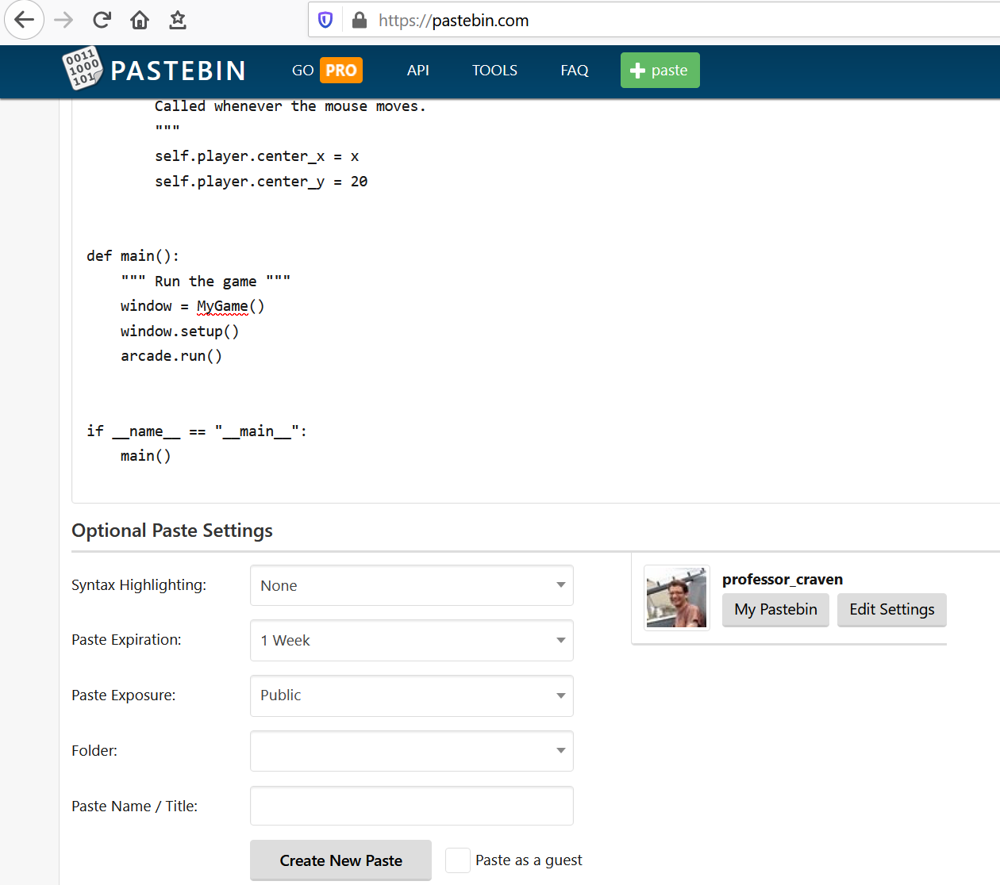

You can also put in a link to your code if you've uploaded it to GitHub.

You can send a direct message to someone by right-clicking on their name. For
example, if you want to ask a question to the instructor, but don't want everyone
to see what the question was.

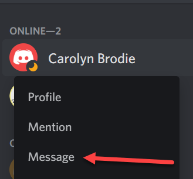

Voice/Video Channels
--------------------

Discord isn't limited to text. You can communicate by voice, video, and screen
sharing. While you can run Discord in a browser, I've found these
features to require the app to run reliably.

These are done in "Voice Channels". Just click on a voice channel to
join (1):

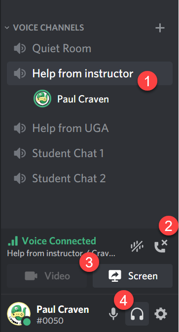

To hang-up and get out of a voice channel, hit the hang-up button (2).

.. important::

    Make sure you hang up your discord when done! It is way too easy to
    stay logged in for yours. That is a serious privacy issue.

You can share video, or your screen by hitting (3). Clicking the microphone
button (4) will mute so that people can't hear you. Clicking the headphones
will make it so you can't hear anyone else. Great if you just want to
hang out in the quiet room for lab and not be bothered by any idle conversation.

When you share your screen, you'll get a window of options like this:

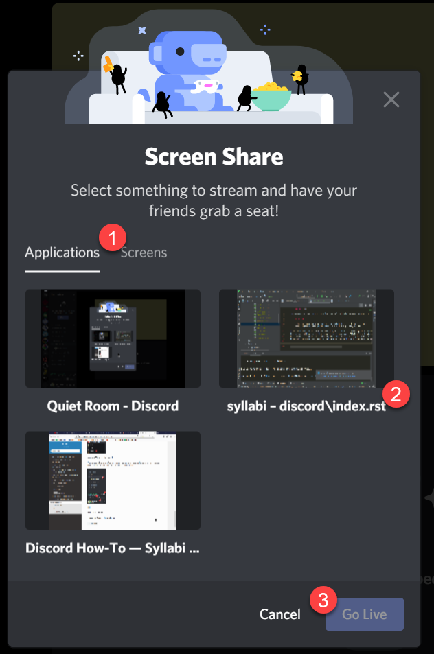

The program has two tabs (1) Applications and Screens. You
can either select just an application window to share, or you can
share your entire screen.

You can select the application you want the other person to see.
In this case, you might select (2) which is the PyCharm window with
my code in it. Then click "Go Live" (3).

If you are running programs or web pages, and need me to see
both the source code and the resulting program/web page, then you
may need to share your entire screen.

When you go live, you can select your video resolution:

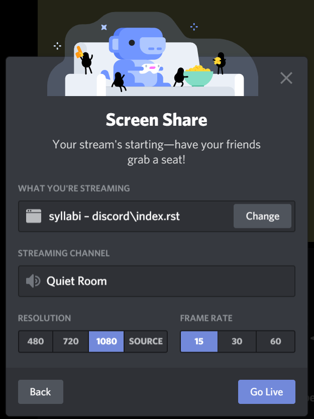

Pick the highest resolution you have available to make the
text readable. I pay for higher resolution, the free accounts
are more limited.
